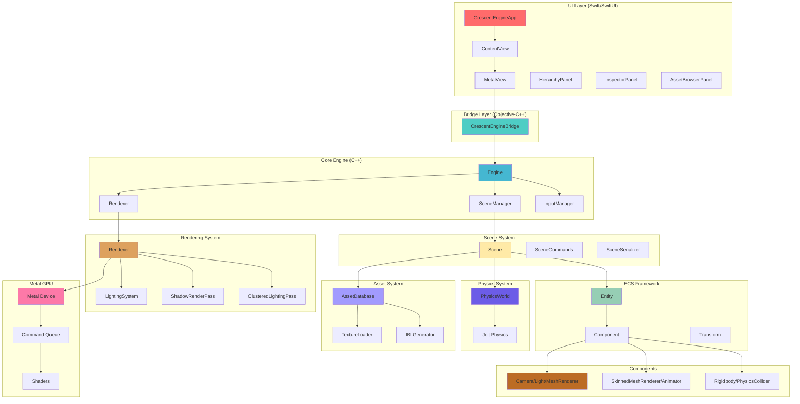
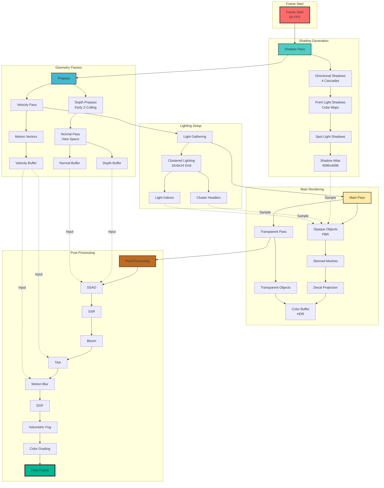
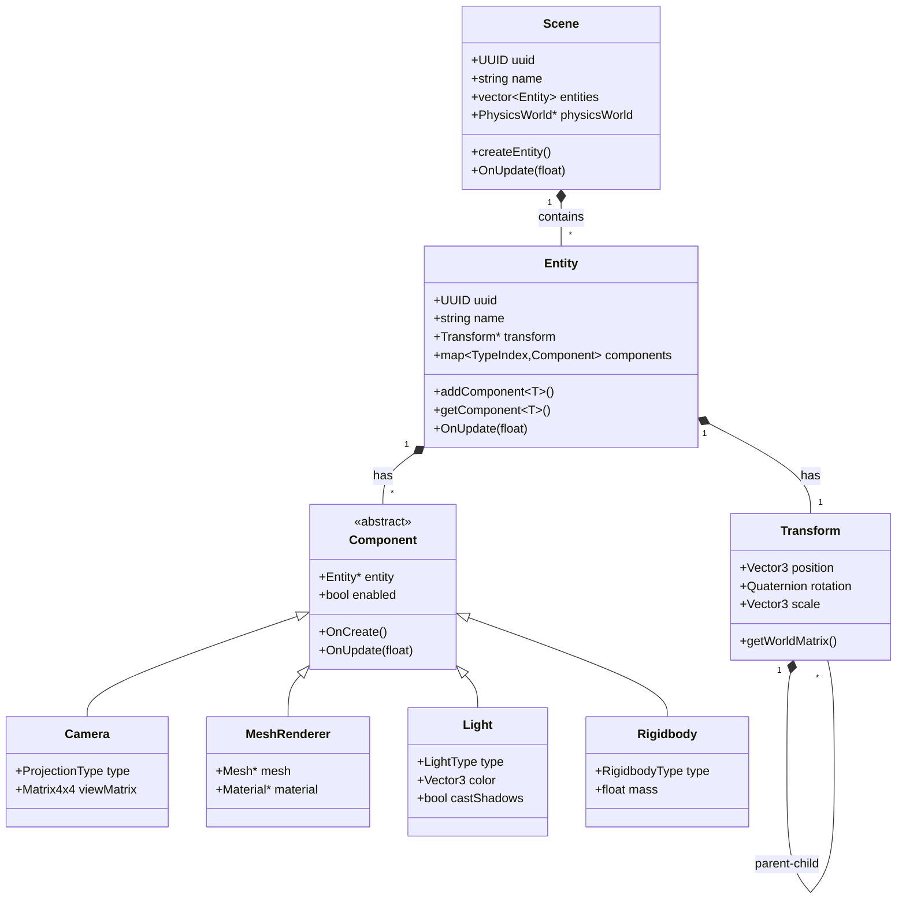
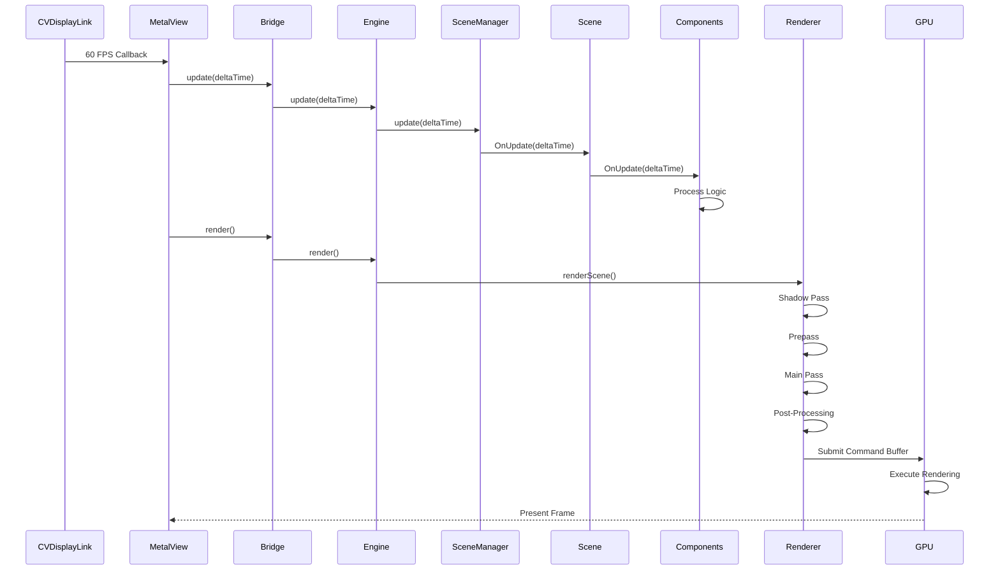
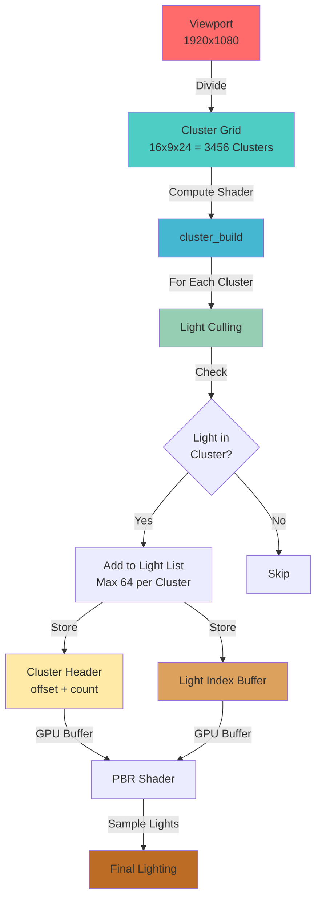
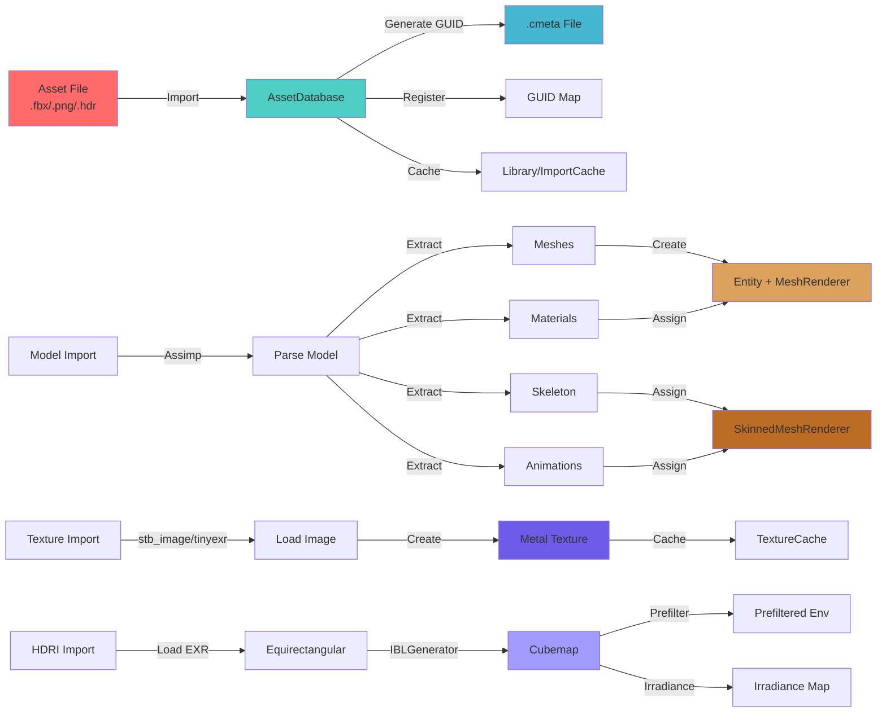

# CrescentEngine

A modern, real-time 3D game engine and editor for macOS, built with Metal, C++17/20, and SwiftUI.


## Overview

CrescentEngine is a comprehensive game engine featuring a complete editor, advanced rendering pipeline, physics simulation, animation system, and asset management. It combines the performance of C++ with the modern UI capabilities of SwiftUI to deliver a native macOS development experience.

## Key Features

### Rendering
- **Metal-based PBR Pipeline** - Physically Based Rendering with industry-standard materials
- **Clustered Lighting** - Efficient rendering of hundreds of lights using GPU compute shaders
- **Advanced Shadows** - Cascaded shadow maps for directional lights, cube maps for point lights
- **Post-Processing** - SSAO, SSR, Bloom, TAA, Motion Blur, DOF, Volumetric Fog, Color Grading
- **IBL System** - Image-Based Lighting with prefiltered environment maps and BRDF LUT
- **Skinned Mesh Rendering** - Full skeletal animation support with bone matrices

### Architecture
- **ECS (Entity-Component-System)** - Modular, flexible game object management
- **Scene Management** - Multiple scenes, play/editor mode separation
- **Component System** - Camera, Light, MeshRenderer, SkinnedMeshRenderer, Animator, Physics, etc.
- **Hierarchical Transforms** - Parent-child relationships with world/local space

### Physics
- **Jolt Physics Integration** - Industry-standard physics engine
- **Rigidbody Dynamics** - Static, Kinematic, and Dynamic bodies
- **Collision Detection** - Box, Sphere, Capsule shapes with collision layers
- **Character Controllers** - Physics-based character movement
- **Contact Events** - Enter, Stay, Exit callbacks

### Animation
- **Skeletal Animation** - Full bone hierarchy support
- **Animation Clips** - Keyframe-based animation with events
- **Animator System** - State machines, blend trees, parameters (float, int, bool, trigger)
- **Root Motion** - Automatic character movement from animation
- **IK Constraints** - Two-bone IK solver for procedural posing

### Editor
- **SwiftUI Interface** - Modern, native macOS editor
- **Scene Hierarchy** - Visual entity tree with drag-and-drop
- **Inspector Panel** - Real-time property editing
- **Asset Browser** - GUID-based asset management
- **Gizmo System** - Translate, Rotate, Scale manipulation
- **Multi-Window Support** - Scene view, Game view, Settings, Animation windows

### Asset Pipeline
- **Multi-Format Import** - FBX, OBJ, GLTF, GLB, DAE, and more via Assimp
- **Texture Support** - PNG, JPG, TGA, EXR, HDR with mipmap generation
- **HDRI Import** - Environment map support with IBL generation
- **GUID System** - Unique asset identification and reference tracking
- **Import Cache** - Optimized asset processing and caching

## Architecture

### System Layers



### Render Pipeline



### ECS System



### Frame Loop



### Clustered Lighting System



### Asset Pipeline



## Quick Start

### Requirements
- **macOS 14+** (Intel or Apple Silicon)
- **Xcode 15+** (Swift 5)
- **CMake 3.26+** and Git (for dependency builds)

### Installation

1. **Clone the repository:**
   ```bash
   git clone https://github.com/yourusername/CrescentEngine.git
   cd CrescentEngine
   ```

2. **Setup dependencies:**
   ```bash
   ./scripts/setup_deps.sh
   ```
   This will build:
   - Jolt Physics (in `ThirdParty/jolt-build-debug` and `jolt-build-release`)
   - Assimp (in `ThirdParty/assimp-build-debug` and `assimp-build-release`)

3. **Open in Xcode:**
   ```bash
   open CrescentEngine.xcodeproj
   ```

4. **Build and Run:**
   - Select the `CrescentEngine` scheme
   - Choose Debug or Release configuration
   - Press ⌘R to build and run

## Features in Detail

### Rendering Features
- PBR (Physically Based Rendering)
- Clustered Lighting (16x9x24 grid, 3456 clusters)
- Cascaded Shadow Maps (4 levels)
- Point Light Cube Maps
- Spot Light Shadows
- Screen-Space Ambient Occlusion (SSAO)
- Screen-Space Reflections (SSR)
- Bloom (5 mip levels)
- Temporal Anti-Aliasing (TAA)
- Motion Blur
- Depth of Field
- Volumetric Fog
- Color Grading (3D LUT)
- Image-Based Lighting (IBL)
- Skinned Mesh Rendering

### Physics Features
- Rigidbody Dynamics (Static, Kinematic, Dynamic)
- Collision Shapes (Box, Sphere, Capsule)
- Collision Layers & Masks
- Contact Events (Enter, Stay, Exit)
- Character Controllers
- First-Person Controllers
- Trigger Volumes

### Animation Features
- Skeletal Animation
- Animation Clips with Events
- Animator State Machine
- Blend Trees (1D parameter-driven)
- Root Motion
- Two-Bone IK Solver
- Animation Parameters (Float, Int, Bool, Trigger)

### Editor Features
- Scene Hierarchy Panel
- Inspector Panel (real-time property editing)
- Asset Browser
- Gizmo System (Translate, Rotate, Scale)
- Multi-Window Support
- Play/Editor Mode Separation
- Scene Serialization (JSON)

## Technology Stack

### Core Technologies
- **C++17/20** - Engine core
- **Swift 5** - Editor UI
- **Objective-C++** - Swift-C++ bridge
- **Metal** - Graphics API
- **Metal Shading Language** - GPU shaders

### Third-Party Libraries
- **Jolt Physics** - Physics simulation
- **Assimp** - 3D model import
- **nlohmann/json** - JSON serialization
- **stb_image** - Image loading
- **tinyexr** - EXR/HDR support

## Project Structure

```
CrescentEngine/
├── CrescentEngine/
│   ├── Bridge/              # Swift-C++ bridge
│   ├── Engine/              # Core engine (C++)
│   │   ├── Core/            # Engine, Selection, Gizmo, Time
│   │   ├── ECS/             # Entity, Component, Transform
│   │   ├── Scene/           # Scene, SceneManager, Serialization
│   │   ├── Renderer/        # Renderer, Lighting, Shadows
│   │   ├── Rendering/       # Mesh, Material, Texture
│   │   ├── Components/      # Camera, Light, MeshRenderer, etc.
│   │   ├── Physics/          # PhysicsWorld, Jolt integration
│   │   ├── Animation/       # Skeleton, AnimationClip, Pose
│   │   ├── Assets/          # AssetDatabase
│   │   ├── IBL/             # IBLGenerator
│   │   ├── Input/           # InputManager
│   │   └── Project/         # Project management
│   ├── Shaders/             # Metal shaders
│   └── UI/                  # SwiftUI editor
├── ThirdParty/              # External dependencies
└── scripts/                 # Build scripts
```

## Performance

### Target Performance (1920x1080)
- **Frame Time:** 16-27ms (60 FPS target)
- **Shadow Pass:** ~2-5ms
- **Main Pass:** ~8-15ms
- **Post-Processing:** ~3-5ms

### GPU Memory (1920x1080)
- **Shadow Atlas:** 64 MB
- **Render Buffers:** ~48 MB
- **Post-Process Buffers:** ~32 MB
- **Total (buffers only):** ~144 MB

## License

MIT License. See `LICENSE` file for details.

## Acknowledgments

- **Jolt Physics** - Physics engine
- **Assimp** - 3D model import
- **nlohmann/json** - JSON library
- **stb_image** - Image loading
- **tinyexr** - EXR support

See `THIRD_PARTY_NOTICES.md` for full attributions.

## Screenshots


## Demo Video
[](https://www.youtube.com/watch?v=5NDLy1gafPQ)
[](https://www.youtube.com/watch?v=PbiNGClqRY8)

---

**Built for macOS**
